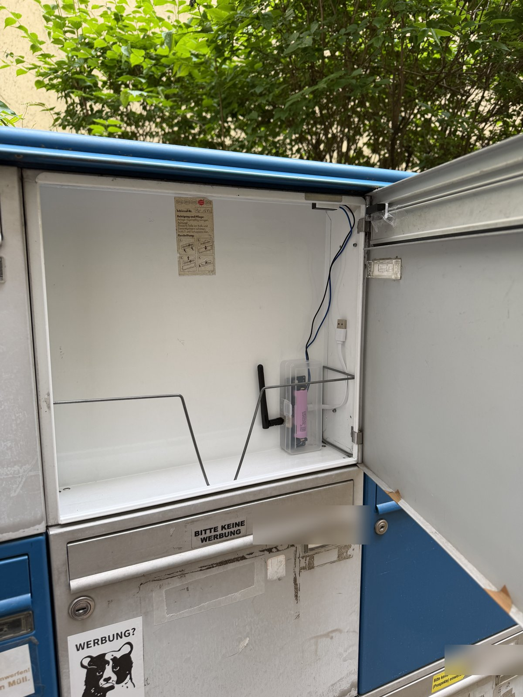
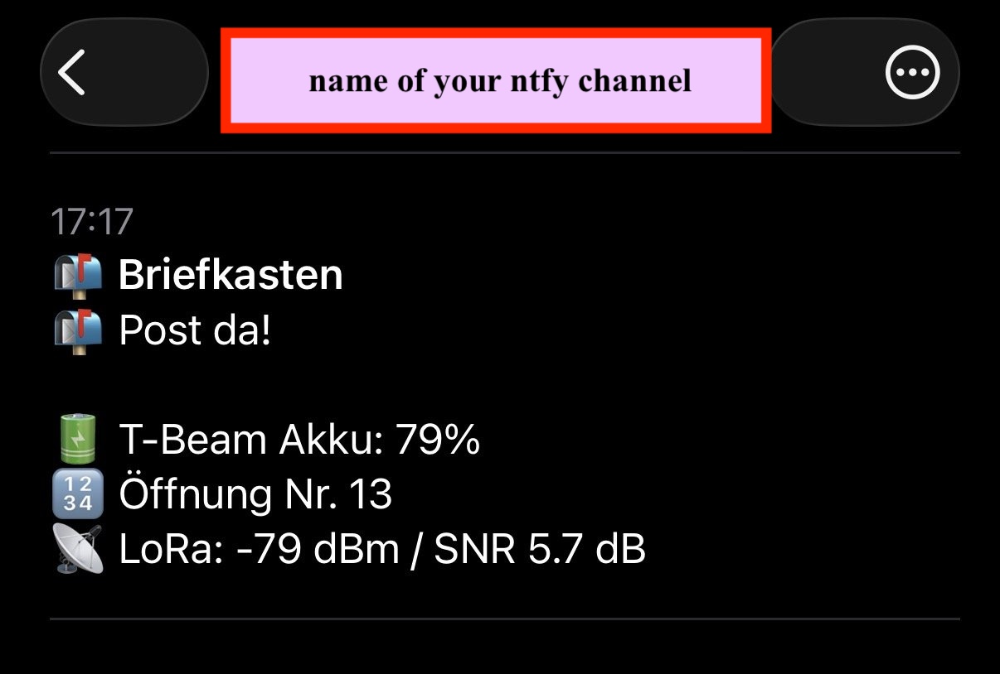
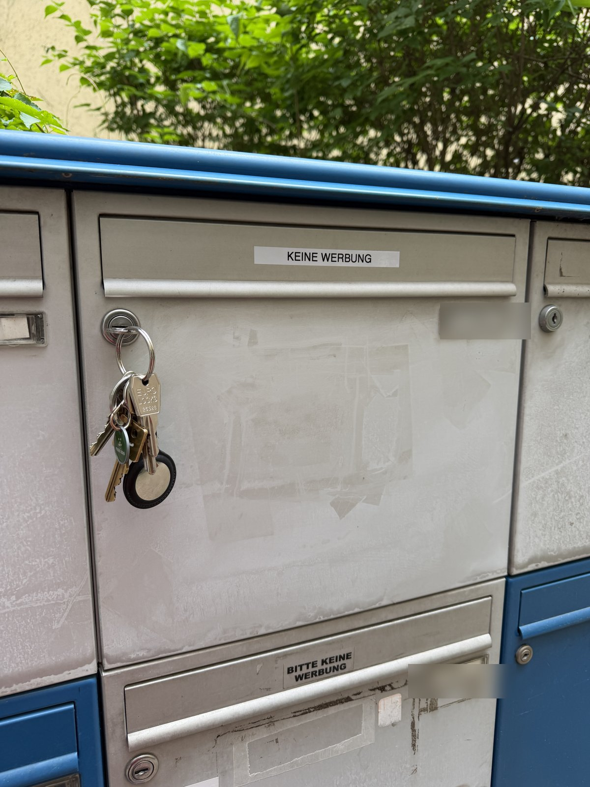
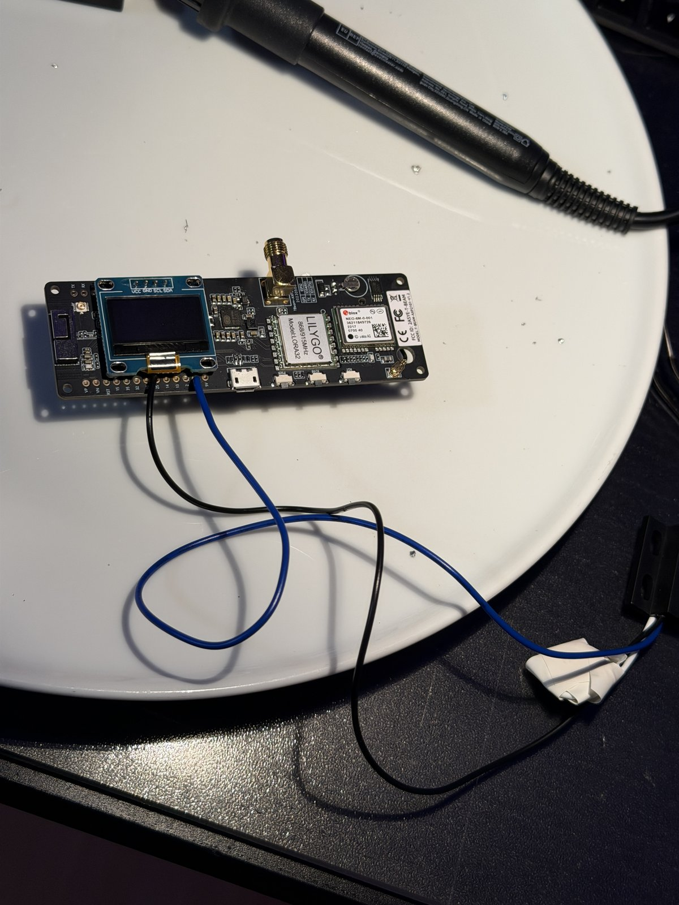
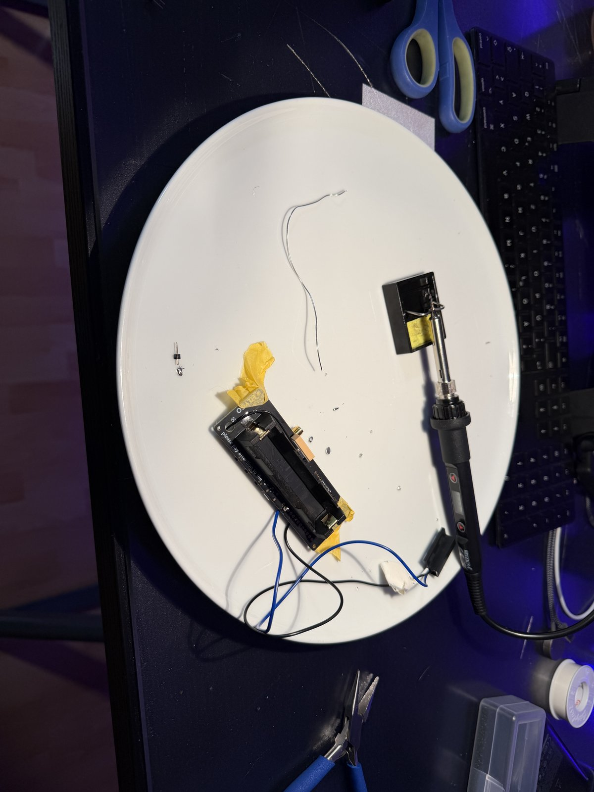
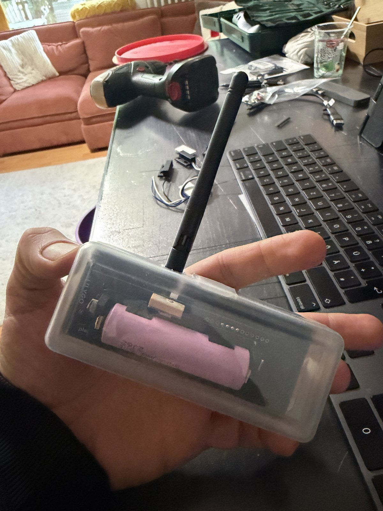
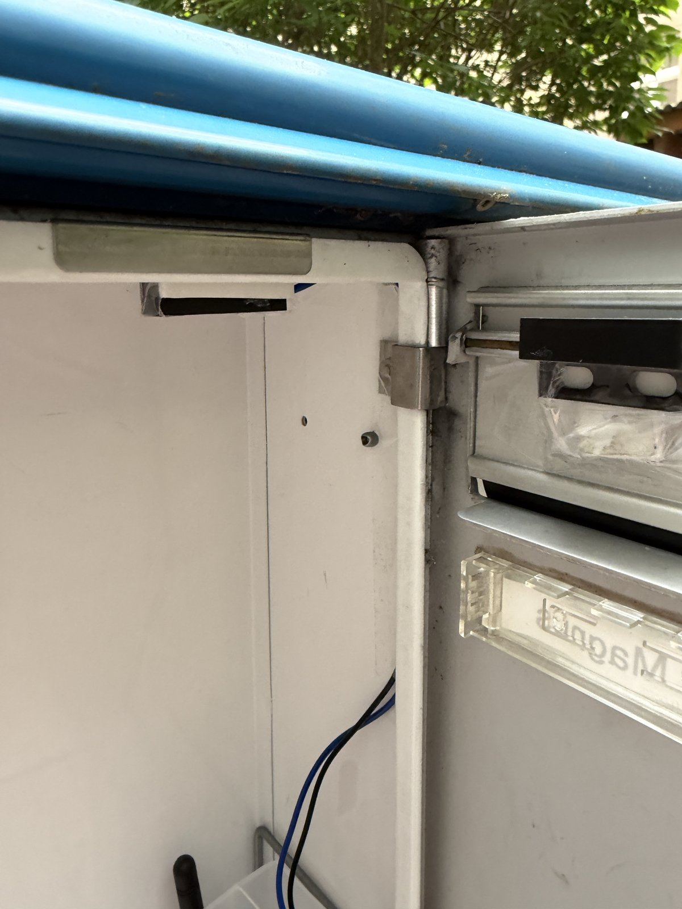
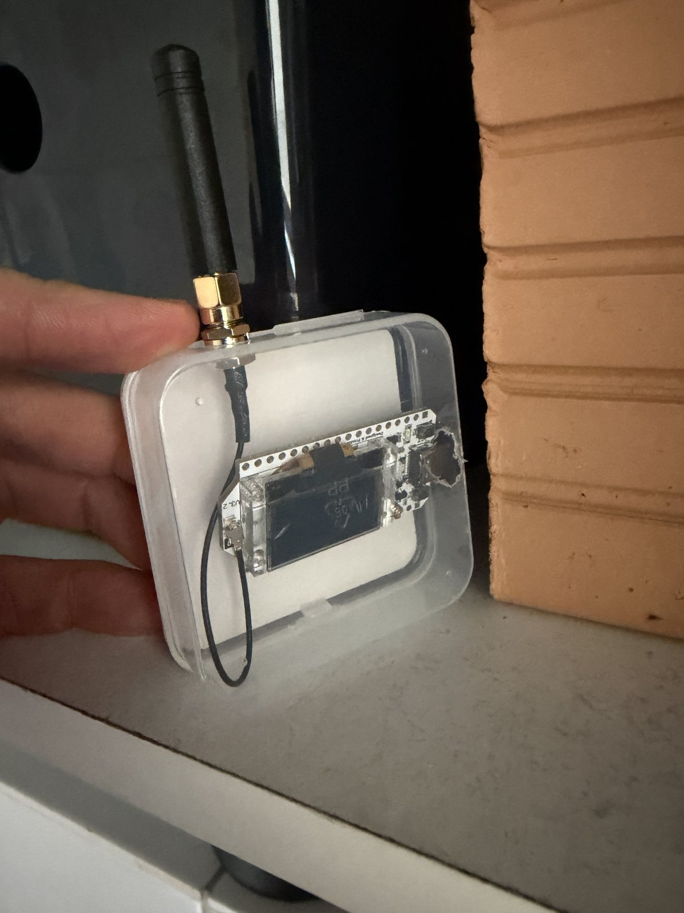
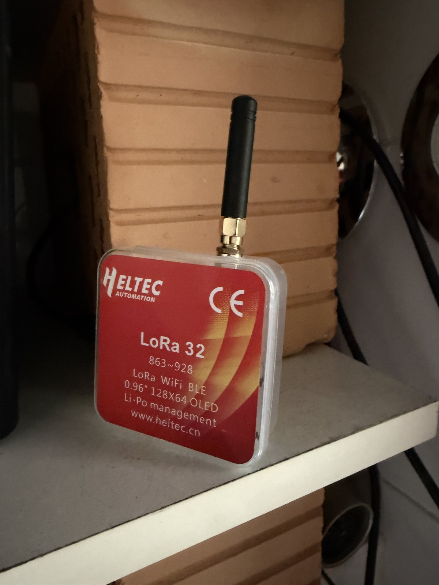

# 📬 Smart Mailbox — LoRa Push Notifications

## 🌟 Featured On Reddit

[](https://www.reddit.com/r/homeautomation/)
[](https://www.reddit.com/r/esp32/)

**20K+ views combined** • Active community discussions • Featured in top DIY electronics communities

---

Get a push notification on your phone the moment someone opens your mailbox. Built with a T-Beam, a Heltec LoRa gateway, and a magnetic reed switch.



## The Problem

My mailbox is a metal box in the courtyard, about 6 meters from my apartment window. I wanted a notification when mail arrives. The obvious solution — WiFi — failed because the closed metal door acts as a **Faraday cage**. The ESP32 measured –93 dBm through the door, which is too weak to establish a new WiFi connection from deep sleep.

## The Solution

**LoRa at 868 MHz** penetrates metal far better than WiFi at 2.4 GHz. Instead of connecting directly to WiFi, the T-Beam sends a short LoRa packet to a gateway sitting on my windowsill. The gateway has WiFi and forwards the notification.

```
Mailbox door opens
  → Reed switch triggers
    → T-Beam wakes from deep sleep
      → Sends LoRa packet (868 MHz)
        → Gateway receives
          → Sends push via ntfy.sh
            → Phone buzzes 📱
```

**Total latency: ~2 seconds.**

## Photos

| | |
|---|---|
|  |  |
| Push notification on iPhone | The mailbox from outside |
|  |  |
| T-Beam with soldered reed switch | First time soldering! |
|  |  |
| T-Beam in DIY enclosure with 18650 battery | Magnet on door, sensor on frame |
|  |  |
| Gateway at the window | Heltec board in original box as enclosure |

## Bill of Materials

| Component | Purpose | Price |
|---|---|---|
| [LILYGO T-Beam v1.2](https://www.lilygo.cc/products/t-beam-v1-2) (AXP2101) | Sender in the mailbox | ~45 € |
| [Heltec WiFi LoRa 32 V3](https://heltec.org/project/wifi-lora-32-v3/) | Gateway in the apartment | ~24 € |
| NC Reed switch with magnet | Door open/close detection | ~3 € |
| 18650 Li-Ion battery | Powers the T-Beam | ~5 € |
| USB-C charger (5V/1A) | Powers the gateway | ~5 € |
| **Total** | | **~80 €** |

You also need: a soldering iron, solder, and a USB-C data cable.

## How It Works

### Sender (T-Beam in the mailbox)

- Sleeps in deep sleep (~µA current draw)
- **NC reed switch** between GPIO 25 and GND
- When the door opens, the magnet moves away → NC contact closes → GPIO 25 goes LOW → wakeup
- Initializes LoRa (SX1276), sends a short message: `MAIL|<count>|<battery%>`
- Goes back to deep sleep
- Battery lasts months

### Gateway (Heltec at the window)

- Runs continuously on USB power
- Listens for LoRa packets (SX1262)
- On receive: connects to WiFi → sends HTTP POST to ntfy.sh
- Anti-spam: max 1 push per 30 seconds
- Auto-reconnects WiFi if connection drops

### Push Service

[ntfy.sh](https://ntfy.sh) — free, no account needed, open source. Install the app, subscribe to a secret topic name, done.

## Wiring

### T-Beam Reed Switch

```
Reed Switch          T-Beam v1.2
──────────          ───────────
Blue  (COM)  ────── GND
Black (NC)   ────── GPIO 25
White (NO)   ────── not connected (cut off)
```

The NC (Normally Closed) contact is closed when no magnet is nearby (= door open). When the magnet is close (= door closed), NC opens and GPIO 25 is pulled HIGH by the internal pullup resistor.

### LoRa Parameters (must match on both devices!)

```
Frequency:        868.0 MHz
Bandwidth:        125.0 kHz
Spreading Factor: 12
Coding Rate:      4/5
Sync Word:        0x12
TX Power:         17 dBm
Preamble:         8
```

## Code

### Sender: [`briefkasten_lora_sender.ino`](briefkasten_lora_sender/briefkasten_lora_sender.ino)

- Board: **ESP32 Dev Module** (Arduino IDE)
- Libraries: `RadioLib`, `XPowersLib`

### Gateway: [`briefkasten_gateway.ino`](briefkasten_gateway/briefkasten_gateway.ino)

- Board: **ESP32S3 Dev Module** (Arduino IDE)
- Libraries: `RadioLib`

> **Note:** Edit `WIFI_PASSWORD` and `NTFY_TOPIC` in both sketches before flashing.

## Setup

1. Install [Arduino IDE](https://www.arduino.cc/en/software)
2. Add ESP32 board support (Board Manager → search "esp32" → install by Espressif)
3. Install libraries: `RadioLib` by Jan Gromeš, `XPowersLib` by Lewis He
4. Flash the sender to the T-Beam (ESP32 Dev Module)
5. Flash the gateway to the Heltec (ESP32S3 Dev Module)
6. Install [ntfy app](https://ntfy.sh) on your phone and subscribe to your topic
7. Solder reed switch to T-Beam (blue→GND, black→GPIO 25)
8. Mount magnet on the mailbox door, sensor on the frame
9. Place gateway near a window with WiFi coverage
10. Done — open the mailbox and watch your phone buzz

## Flashing Tip

If you run into `StopIteration: The chip stopped responding` errors with newer ESP32 board packages (3.2+), flash via command line with an older esptool:

```bash
pip3 install esptool
python3 -m esptool --port /dev/cu.usbserial-XXXXX --baud 460800 write_flash 0x0 build/esp32.esp32.esp32/sketch.ino.merged.bin
```

## Results

| Metric | Value |
|---|---|
| Latency | ~2 seconds |
| LoRa signal | –78 dBm (margin to –130 dBm) |
| WiFi signal (failed) | –93 dBm (too weak through metal) |
| Battery life | Months (deep sleep, GPS module disabled — see below) |
| False triggers | 0 (5-sample debounce) |

## What I Learned

This was my first electronics project — first time soldering, first time programming a microcontroller, first time using LoRa. Some takeaways:

- **Metal mailboxes kill WiFi.** 2.4 GHz doesn't stand a chance against a closed metal door. LoRa at 868 MHz goes right through.
- **Deep sleep is essential.** Without it, the 18650 battery would last days instead of months.
- **NC reed switches need the right wakeup level.** The ext0 wakeup must trigger on LOW (when the NC contact closes as the magnet moves away).
- **ntfy.sh is incredibly simple.** No server, no account, no API key. Just POST to a URL.
- **`esp_deep_sleep_start()` doesn't cut peripheral power.** First version of the firmware drained 60% of the battery in a single day. The T-Beam's GPS module (NEO-6M, ~30–50 mA) kept running because the AXP2101 PMU was still powering it. Fix: explicitly call `pmu.disableALDO3()` before sleep — and `disableALDO4()`, `disableBLDO1()`, `disableBLDO2()`, plus `disableALDO2()` for LoRa once the packet is sent. After this, the battery lasts as expected. **Lesson: when a development board ships with peripherals you're not using, the PMU is still powering them. Cut them off.**
- **An AI assistant can walk you through an entire hardware project** — from choosing components to soldering to debugging LoRa signal issues.

## License

MIT — do whatever you want with it.
